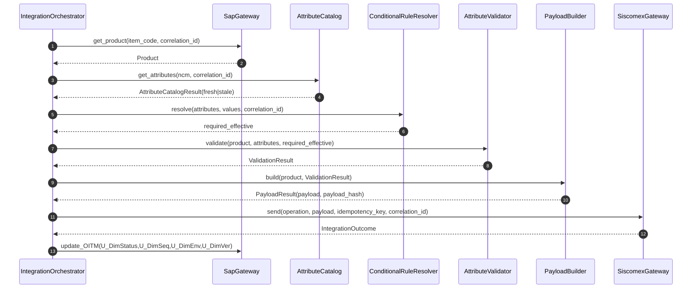
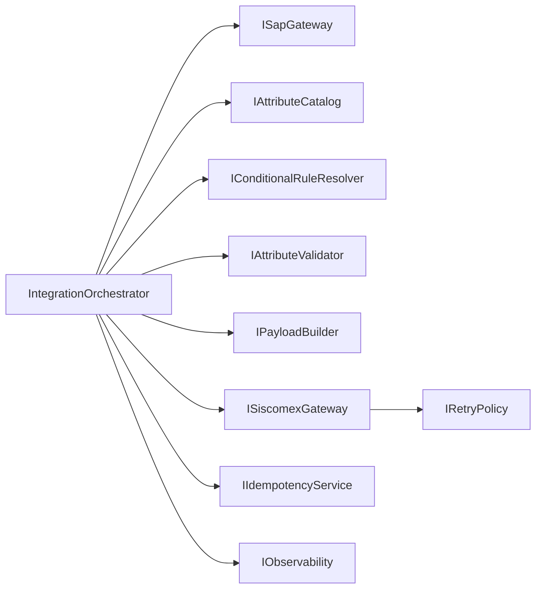

# Arquitetura — Fase 2 (Design e Arquitetura)

## 1. Escopo e Restrições
- Equipe enxuta (2 pessoas), sem overengineering.
- Sem criação de tabelas novas.
- Sem persistência paralela em banco.
- Persistência oficial no SAP `dbo.OITM`:
  - `U_DimVer`
  - `U_DimEnv`
  - `U_DimStatus`
  - `U_DimSeq`

## 2. Módulos principais
1. `IntegrationOrchestrator`
2. `SapGateway`
3. `AttributeCatalog`
4. `ConditionalRuleResolver`
5. `AttributeValidator`
6. `PayloadBuilder`
7. `SiscomexGateway`
8. `RetryPolicy`
9. `IdempotencyService`
10. `Observability`

## 3. Fluxo principal
1. Ler produto no SAP  
2. Consultar atributos por NCM  
3. Resolver regras condicionais  
4. Validar obrigatoriedade/tipo/vigência  
5. Montar payload canônico  
6. Enviar ao SISCOMEX  
7. Atualizar status no SAP + observabilidade

## 4. Diagrama de sequência (principal)

## 5. Diagrama lógico de módulos e interfaces

## 6. Estados e transições (`U_DimStatus`)
Estados canônicos:
- `PENDENTE`, `EM_VALIDACAO`, `VALIDADO`, `EM_ENVIO`, `ENVIADO`,
- `ERRO_VALIDACAO`, `ERRO_TRANSIENTE`, `ERRO_PERMANENTE`

Transições:
- `PENDENTE -> EM_VALIDACAO -> VALIDADO -> EM_ENVIO -> ENVIADO`
- `EM_VALIDACAO -> ERRO_VALIDACAO`
- `EM_ENVIO -> ERRO_TRANSIENTE | ERRO_PERMANENTE`
- `ERRO_TRANSIENTE -> EM_ENVIO` (retry)
- `ERRO_PERMANENTE -> EM_VALIDACAO` (após correção)

## 7. Decisões transversais
- `correlation_id` obrigatório ponta a ponta.
- Retry apenas para `timeout`, `429`, `5xx` (max_attempts=3, backoff+jitter).
- Idempotência determinística por hash canônico.
- Observabilidade fail-safe (nunca bloqueia fluxo).